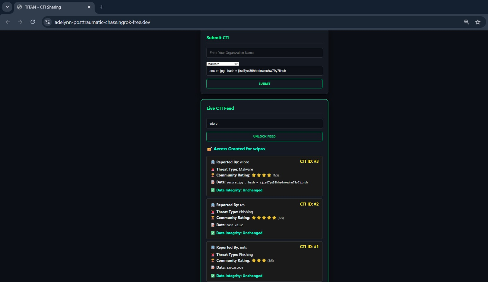
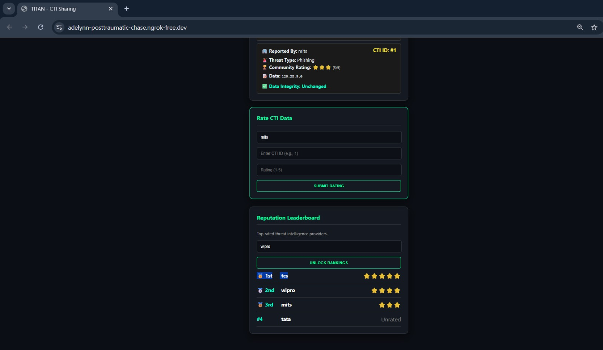
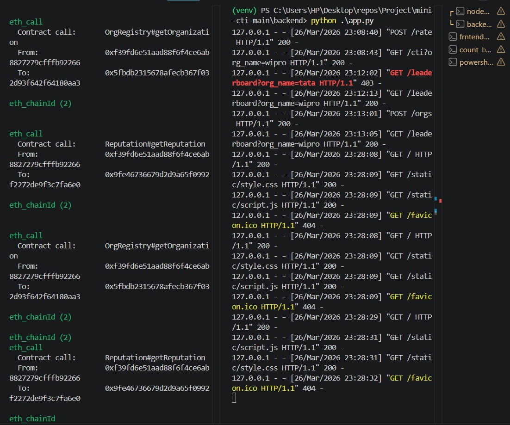
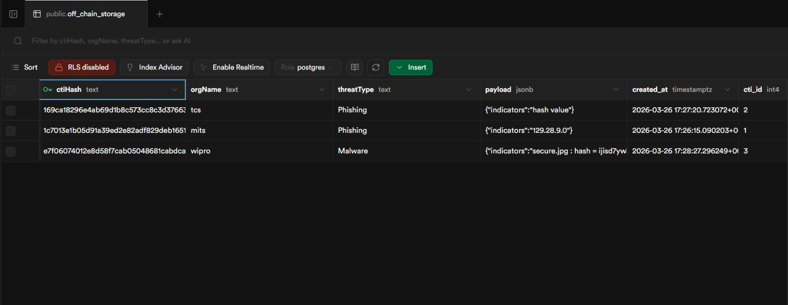
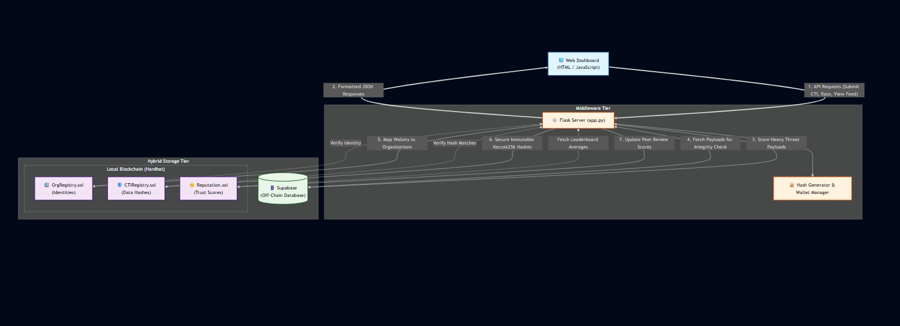

# TITAN: Trust-Aware Decentralized Cyber Threat Intelligence Sharing Platform

## Overview

TITAN is a decentralized Cyber Threat Intelligence (CTI) sharing platform that enables organizations to securely exchange threat intelligence without relying on a central authority.

The platform combines blockchain technology, smart contracts, reputation scoring, and hybrid storage architecture to ensure transparency, trust, and data integrity in threat intelligence sharing.

---

## Problem Statement

Traditional Cyber Threat Intelligence sharing systems are centralized and face several challenges:

* Single Point of Failure (SPOF)
* Lack of transparency and auditability
* Risk of fake or low-quality threat intelligence
* Freeriding by participants
* Limited trust among organizations

TITAN addresses these challenges through decentralized trust management and blockchain-based verification.

---

## Key Features

* Secure CTI submission and sharing
* Blockchain-based integrity verification
* Reputation-driven trust scoring
* Organization registration and management
* Off-chain storage for threat payloads
* Real-time CTI feed access
* Reputation leaderboard for trusted contributors
* Hybrid storage architecture using blockchain and database systems

---

## Technology Stack

### Frontend

* HTML
* CSS
* JavaScript

### Backend

* Python
* Flask

### Blockchain

* Solidity
* Ethereum
* Hardhat
* Web3.py

### Database

* Supabase

---

## System Architecture

The system consists of:

* Web Dashboard
* Flask Backend Server
* Ethereum Smart Contracts
* Hardhat Local Blockchain
* Supabase Off-Chain Storage

### Smart Contracts

* OrgRegistry.sol – Organization registration and identity management
* CTIRegistry.sol – CTI hash registration and verification
* Reputation.sol – Reputation score management

---

## Workflow

1. Organizations register on the platform.
2. Threat intelligence is submitted through the dashboard.
3. Threat data is validated.
4. SHA-256 hash is generated.
5. Full payload is stored off-chain in Supabase.
6. Hash is stored on the blockchain using smart contracts.
7. Participants rate CTI quality.
8. Reputation scores are updated automatically.
9. Verified CTI feeds are shared with participants.

---

## Screenshots

### Dashboard

### Reputation Leaderboard

### Blockchain and Backend Interaction

### Off-Chain Storage

### System Architecture

---

## My Contributions

* Developed frontend interfaces using HTML, CSS, and JavaScript.
* Designed and implemented the dashboard for CTI submission, feed viewing, rating, and reputation leaderboard.
* Prepared project documentation, technical reports, and presentations.
* Conducted functional and integration testing.
* Assisted in validating blockchain interactions, API workflows, and data integrity mechanisms.

---

## Future Enhancements

* AI-assisted threat validation
* Public Ethereum deployment
* STIX/TAXII integration
* Real-time threat intelligence feeds
* Advanced trust and reputation algorithms

---

## Academic Project

Department of Cyber Security

Muthoot Institute of Technology and Science (MITS)

Academic Year: 2025–2026
